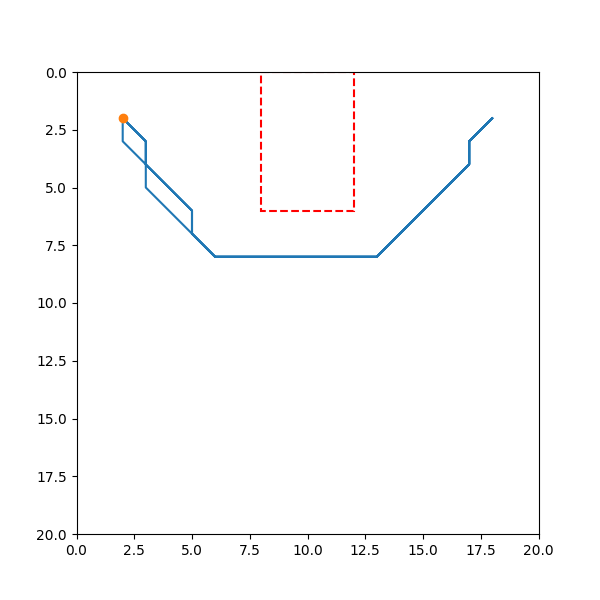

# UGV Mission Planner (GenAI-Guarded)





> **TL;DR** — Natural-language missions → **schema-validated MissionPlan** → **deterministic** A* planning/execution → **policy guardrails** (geofences, speed caps) with **observable artifacts** (PASS/FAIL metrics + GIF).  
> GenAI is **boxed** to the interface: it interprets text into a strict schema; planning/execution are deterministic and testable.

---

## 🎯 Objective

Showcase an interview-ready, safety-aware system architecture:

- **Contracts-first:** strict JSON Schema + Pydantic models.
- **GenAI at the edges:** LLM parses NL → structured plan; the core is deterministic.
- **Policy by design:** geofences painted onto the grid; **automatic A\*** fallback if a plan would violate policy.
- **Traceability:** every run has a **trace id** and produces artifacts (logs, PASS/FAIL, GIF) you can share.

---

## 🧩 What GenAI does vs. what’s deterministic

| Layer | Responsibility | Tech |
|---|---|---|
| **GenAI interface** | Parse free-text mission into a schema (`goals`, `constraints`) | OpenAI `gpt-4o-mini` (configurable), LangChain-OpenAI |
| **Deterministic core** | Path planning, waypoint speeds, execution stubs | Python, A\*, NumPy |
| **Guardrails** | Enforce geofences/speed; replan with A\* if needed | Grid painting + A\* fallback |
| **Observability** | Trace IDs, PASS/FAIL report, GIF artifacts | Structured logs, verifier, Matplotlib |

---

## 🚀 90-Second Demo (with OpenAI LLM)

> Requires an OpenAI key to show the LLM’s value (robust NL parsing). A FakeLLM is available for tests.

```powershell
# Windows PowerShell
python -m venv .venv
.\.venv\Scripts\activate
pip install -e ."[dev]"

# Use the real LLM
$env:OPENAI_API_KEY = "sk-..."          # <-- your key
Remove-Item Env:UGV_FAKE_LLM -ErrorAction SilentlyContinue
$env:UGV_OPENAI_MODEL = "gpt-4o-mini"   # optional (default is the same)

# Safety/visualization configs (optional but recommended)
$env:UGV_OCC_MODE = "one_is_blocked"    # grid: 0=free, >0=blocked
$env:UGV_AVOID_INFLATE_CELLS = "2"      # 2-cell safety margin around avoid zones
$env:UGV_EXEC_DT = "0.05"               # smoother animation
$env:UGV_VERBOSE = "1"                  # more logs

# One-shot: NL → Plan → Verify → GIF
python scripts/run_from_nl.py `
  --map examples/maps/open_area.npy `
  --mission "Patrol between (2,2) and (18,2) twice, avoid [8,0,12,6], max speed 1.2 m/s" `
  --save-gif
